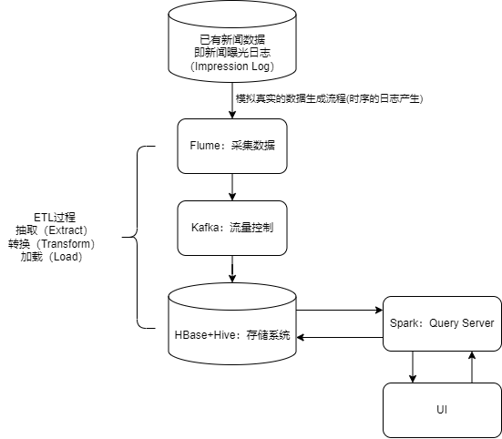

# BI_NewsAnalysis
 A project covers news data generation, transforming, processing and analysis.

## 架构设计

## 存储系统设计

使用HBase+Hive的设计。

Hive主要使用在ETL过程中。

HBase主要面向Query请求。

## 数据集

### news.tsv

新闻数据

包含共七个字段（News ID, Category, Topic, Headline, News body, Title entity, Entity content）

| Column         | Example Context                                              | Description                                                  |
| -------------- | ------------------------------------------------------------ | ------------------------------------------------------------ |
| News ID        | N10000                                                       | 新闻的唯一ID                                                 |
| Category       | sports                                                       | 属于15个类别中的一个                                         |
| Topic          | soccer                                                       | 新闻的具体主题                                               |
| Headline       | Predicting Atlanta United's lineup against Columbus Crew in the U.S. Open Cup | 新闻标题                                                     |
| News body      | Only FIVE internationals allowed, count em, FIVE! So first off we should say, per our usual Atlanta United lineup predictions, this will be wrong... | 新闻正文                                                     |
| Title entity   | {"Atlanta United's": 'Atlanta United FC'}                    | 标题中短语与wikidata中实体的映射                             |
| Entity content | {'Atlanta United FC': { 'type': 'item', 'id': 'Q16836317', 'labels': {...}, 'descriptions': {...}, 'aliases': {...}, 'claims': {...}, 'sitelinks': {...}, 'lastrevid': 1452771827}, ...} | 实体名称与wikidata中实体内容的映射。详细的数据结构请参考官方文档 |

### train.tsv&valid.tsv

每一条记录是一次曝光

该记录会存储用户的历史浏览信息

训练集（Training Set）和验证集（Validation Set）

包含共九个字段（UserID, ClicknewsID, dwelltime, exposure_time, pos, neg, start, end, dwelltime_pos）

| Column        | Example Context              | Description                                                  |
| ------------- | ---------------------------- | ------------------------------------------------------------ |
| UserID        | U335175                      | 用户的唯一ID                                                 |
| ClicknewsID   | N41340 N27570 N83288 ...     | 用户历史点击的新闻ID                                         |
| dwelltime     | 116 23 59 ...                | 用户在历史点击的新闻上的浏览时长（单位可能是秒或其他）       |
| exposure_time | 6/19/2019 5:10:01 AM#TAB#... | 历史点击新闻的曝光时间，可以通过'#TAB#'分割                  |
| pos           | N55476 N103556 N52756 ...    | 本次曝光中用户点击的新闻ID                                   |
| neg           | N48119 N92507 N92467 ...     | 本次曝光中用户未点击的新闻ID                                 |
| start         | 7/3/2019 6:43:49 AM          | 本次曝光的开始时间                                           |
| end           | 7/3/2019 7:06:06 AM          | 本次曝光的结束时间                                           |
| dwelltime_pos | 34 83 79 ...                 | 用户在本次曝光中点击的新闻上的浏览时长（单位可能是秒或其他） |

### personalized_test.tsv

| Column         | Example Context                                              | Description                                                  |
| -------------- | ------------------------------------------------------------ | ------------------------------------------------------------ |
| userid         | NT1                                                          | 103个用户的唯一ID                                            |
| clicknewsID    | N108480,N38238,N35068, ...                                   | 第一阶段收集的用户历史点击新闻ID列表                         |
| posnewID       | N24110,N62769,N36186, ...                                    | 第二阶段向用户展示的新闻ID列表                               |
| rewrite_titles | 'Legal battle looms over Trump EPA\'s rule change of Obama\'s Clean Power Plan rule ...'#TAB#... | 手动编写的新闻标题列表，为第二阶段展示的新闻文章所准备，可通过'#TAB#'分割 |
