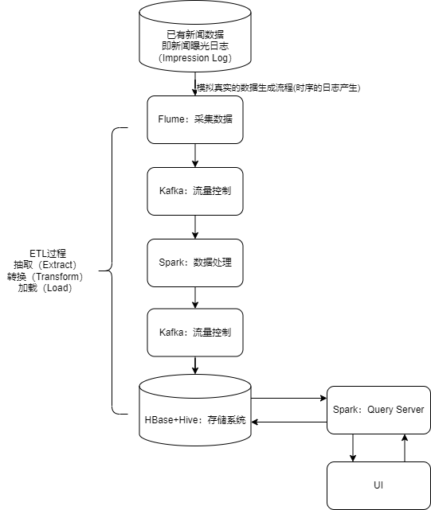

# BI_NewsAnalysis
 A project covers news data generation, transforming, processing and analysis.

## 架构设计

## 存储系统设计

使用HBase和Redis。

主要面向ETL结果存储和Query请求。

## 数据集

### news.tsv

新闻数据

包含共七个字段（News ID, Category, Topic, Headline, News body, Title entity, Entity content）

| Column         | Example Context                                              | Description                                                  |
| -------------- | ------------------------------------------------------------ | ------------------------------------------------------------ |
| News ID        | N10000                                                       | 新闻的唯一ID                                                 |
| Category       | sports                                                       | 属于15个类别中的一个                                         |
| Topic          | soccer                                                       | 新闻的具体主题                                               |
| Headline       | Predicting Atlanta United's lineup against Columbus Crew in the U.S. Open Cup | 新闻标题                                                     |
| News body      | Only FIVE internationals allowed, count em, FIVE! So first off we should say, per our usual Atlanta United lineup predictions, this will be wrong... | 新闻正文                                                     |
| Title entity   | {"Atlanta United's": 'Atlanta United FC'}                    | 标题中短语与wikidata中实体的映射                             |
| Entity content | {'Atlanta United FC': { 'type': 'item', 'id': 'Q16836317', 'labels': {...}, 'descriptions': {...}, 'aliases': {...}, 'claims': {...}, 'sitelinks': {...}, 'lastrevid': 1452771827}, ...} | 实体名称与wikidata中实体内容的映射。详细的数据结构请参考官方文档 |

### train.tsv&valid.tsv

每一条记录是一次曝光

该记录会存储用户的历史浏览信息

训练集（Training Set）和验证集（Validation Set）

包含共九个字段（UserID, ClicknewsID, dwelltime, exposure_time, pos, neg, start, end, dwelltime_pos）

| Column        | Example Context              | Description                                                  |
| ------------- | ---------------------------- | ------------------------------------------------------------ |
| UserID        | U335175                      | 用户的唯一ID                                                 |
| ClicknewsID   | N41340 N27570 N83288 ...     | 用户历史点击的新闻ID                                         |
| dwelltime     | 116 23 59 ...                | 用户在历史点击的新闻上的浏览时长（单位可能是秒或其他）       |
| exposure_time | 6/19/2019 5:10:01 AM#TAB#... | 历史点击新闻的曝光时间，可以通过'#TAB#'分割                  |
| pos           | N55476 N103556 N52756 ...    | 本次曝光中用户点击的新闻ID                                   |
| neg           | N48119 N92507 N92467 ...     | 本次曝光中用户未点击的新闻ID                                 |
| start         | 7/3/2019 6:43:49 AM          | 本次曝光的开始时间                                           |
| end           | 7/3/2019 7:06:06 AM          | 本次曝光的结束时间                                           |
| dwelltime_pos | 34 83 79 ...                 | 用户在本次曝光中点击的新闻上的浏览时长（单位可能是秒或其他） |

### personalized_test.tsv

| Column         | Example Context                                              | Description                                                  |
| -------------- | ------------------------------------------------------------ | ------------------------------------------------------------ |
| userid         | NT1                                                          | 103个用户的唯一ID                                            |
| clicknewsID    | N108480,N38238,N35068, ...                                   | 第一阶段收集的用户历史点击新闻ID列表                         |
| posnewID       | N24110,N62769,N36186, ...                                    | 第二阶段向用户展示的新闻ID列表                               |
| rewrite_titles | 'Legal battle looms over Trump EPA\'s rule change of Obama\'s Clean Power Plan rule ...'#TAB#... | 手动编写的新闻标题列表，为第二阶段展示的新闻文章所准备，可通过'#TAB#'分割 |

## HBase表设计

### News Clicks
table name: news_clicks

description: 用于存储新闻的被曝光时间和用户浏览时间

attribute:

- news_id
- exposure_time
- dwelltime

row key:

news_id + exposure_time : bytes

ddl:

create "news_clicks" ,"info"

### User History
table name: user_history

description: 用于存储用户访问记录，包括未访问和访问的新闻

attribute:

- user_id
- news_id
- is_clicked
- exposure_time
- dwelltime

row key:

user_id + news_id + exposure_time : bytes

ddl:

create "user_history", "info"

#### News Info
table name: news_info

description: 新闻信息

attribute:

- news_id
- category
- topic
- headline
- news_body
- title_entity
- entity_content

ddl:

create "news_info", "info"

## Redis数据结构设计

### 新闻种类查询

有如下种类：

- sports
- news
- autos
- foodanddrink
- finance
- music
- lifestyle
- weather
- health
- video
- movies
- tv
- travel
- entertainment
- kids
- europe
- northamerica
- adexperience

考虑在Redis中，对于每一类创建一个Sorted Set

## 业务逻辑

要求如下功能：

1、对单个新闻的生命周期的查询，可以展示单个新闻在不同时间段的流行变化

2、对某些种类的新闻的变化情况的统计查询，可以展示不同类别的

3、对用户兴趣变化的统计查询

4、可以按照时间/时间段、新闻主题、新闻标题长度、新闻长度、特定用户、特定多个用户等多种条件和组合进行统计查询

5、能够实时按照用户浏览的内容进行新闻推荐

6、需要建立查询日志，能够记录所有的SQL查询记录和查询时间，便于对性能指标进行检验和优化

### FuncPt0：获取新闻信息

#### 存储设计：

NewsInfo存储在HBase中，无需再推送到Redis中。

原因：对于发起请求，使用RowKey进行定位，可以发现在查询需要的时间在15-40ms之间，已经相当短。若使用Redis优化，可以使响应时间来到10ms以内，但可能会占用较大空间，因此无需再优化。

#### 业务设计：

使用newsID作为RowKey直接进行定位。

### FuncPt1：新闻生命周期（新闻历史点击）

#### 存储设计：

使用HBase，能做到500ms左右的响应时间

**改为Redis？TBD**

#### 业务设计：

根据时间跨度，均分为10个数据点（数据点）。

对于History的每一条记录，若在该时间切片中，则时间切片的计数器+1。

最后返回的结果应当是：[{TimeStamp, Clicks}, {...}, ...]。

### FuncPt2：特定种类新闻访问情况

#### 存储设计：

先用HBase，但预估要使用Redis，对于每个种类，对时间切片。

而后遍历记录？时间太长了。

### FuncPt3：用户兴趣变化查询（用户历史点击）

输入：用户ID，时间段

输出：新闻种类访问量随时间变化；例如对于输入的时间段，切分为10段，统计各个段中哪类新闻访问量最多。
